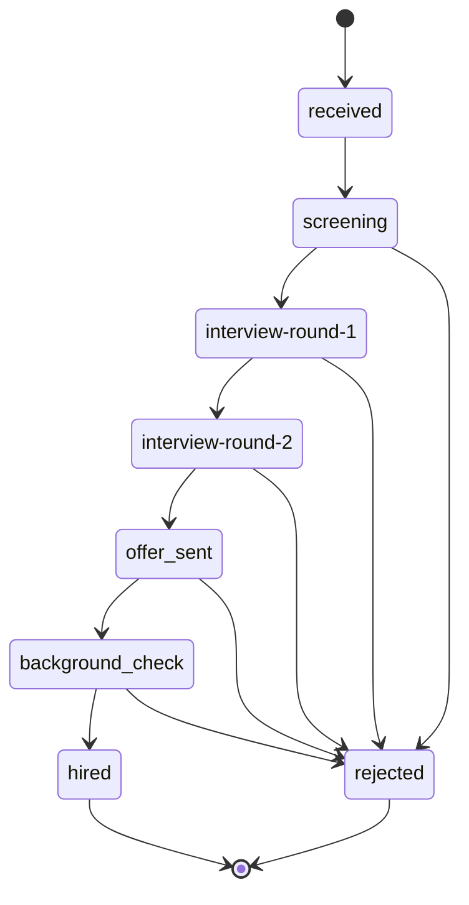
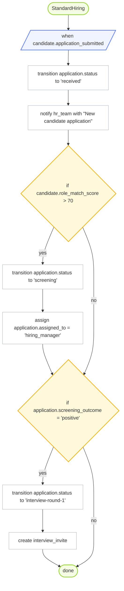

# OrgScript Mermaid Export

## Stateflow: ApplicationLifecycle

## Process: StandardHiring

> Note: Mermaid export currently supports only process and stateflow blocks. Skipped: role HiringManager, role HumanResources, role Candidate, policy GDPRCompliance, rule ScreeningMandatory.
