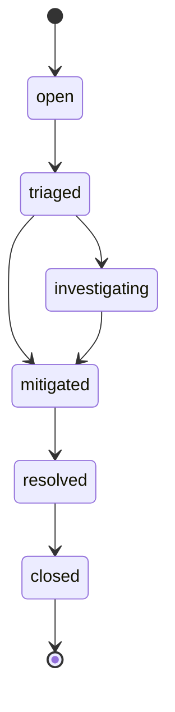
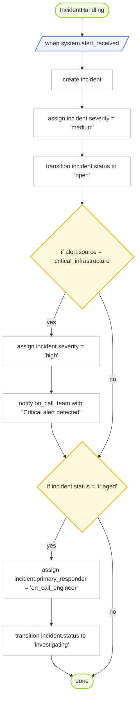

# OrgScript Mermaid Export

## Stateflow: IncidentLifecycle

## Process: IncidentHandling

> Note: Mermaid export currently supports only process and stateflow blocks. Skipped: role OnCallEngineer, role IncidentManager, policy EscalationPolicy.
