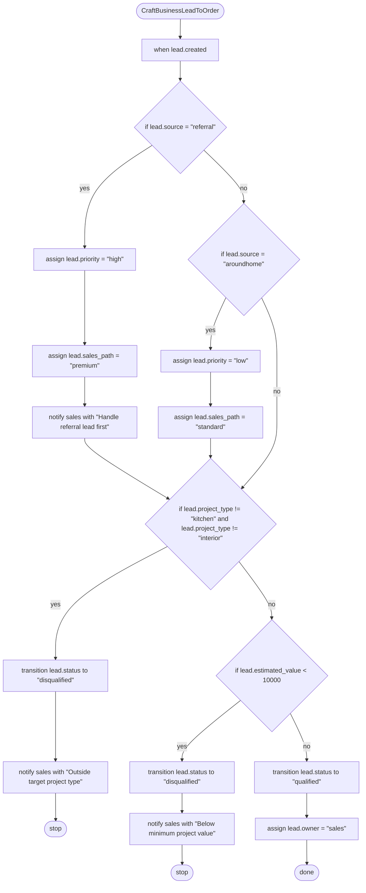
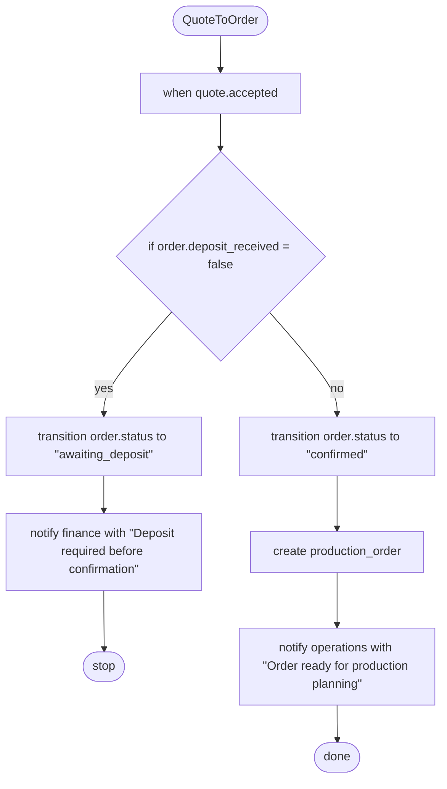
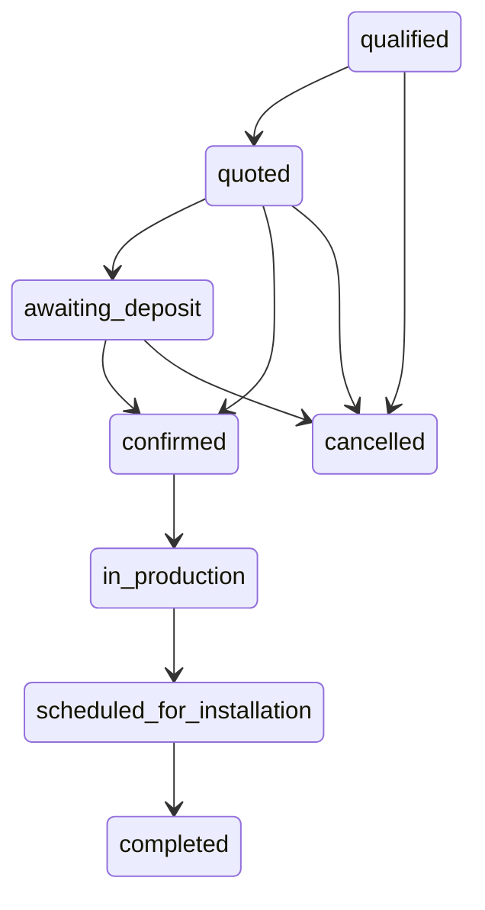

# OrgScript Mermaid Export

## Process: CraftBusinessLeadToOrder

## Process: QuoteToOrder

## Stateflow: OrderLifecycle

> Note: Mermaid export currently supports only process and stateflow blocks. Skipped: rule NoProductionWithoutDeposit.
