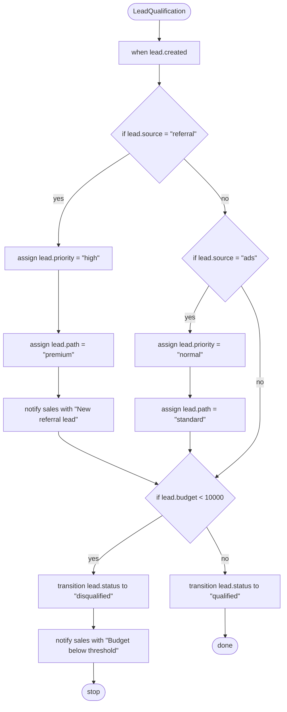

# OrgScript Mermaid Export

## Process: LeadQualification

```mermaid
flowchart TD
  p1_start_1(["LeadQualification"])
  p1_action_2["when lead.created"]
  p1_decision_3{"if lead.source = &quot;referral&quot;"}
  p1_action_4["assign lead.priority = &quot;high&quot;"]
  p1_action_5["assign lead.path = &quot;premium&quot;"]
  p1_action_6["notify sales with &quot;New referral lead&quot;"]
  p1_decision_7{"if lead.source = &quot;ads&quot;"}
  p1_action_8["assign lead.priority = &quot;normal&quot;"]
  p1_action_9["assign lead.path = &quot;standard&quot;"]
  p1_decision_10{"if lead.budget < 10000"}
  p1_action_11["transition lead.status to &quot;disqualified&quot;"]
  p1_action_12["notify sales with &quot;Budget below threshold&quot;"]
  p1_stop_13(["stop"])
  p1_action_14["transition lead.status to &quot;qualified&quot;"]
  p1_end_15(["done"])
  p1_start_1 --> p1_action_2
  p1_action_2 --> p1_decision_3
  p1_decision_3 -->|yes| p1_action_4
  p1_action_4 --> p1_action_5
  p1_action_5 --> p1_action_6
  p1_decision_3 -->|no| p1_decision_7
  p1_decision_7 -->|yes| p1_action_8
  p1_action_8 --> p1_action_9
  p1_action_6 --> p1_decision_10
  p1_action_9 --> p1_decision_10
  p1_decision_7 -->|no| p1_decision_10
  p1_decision_10 -->|yes| p1_action_11
  p1_action_11 --> p1_action_12
  p1_action_12 --> p1_stop_13
  p1_decision_10 -->|no| p1_action_14
  p1_action_14 --> p1_end_15
```
