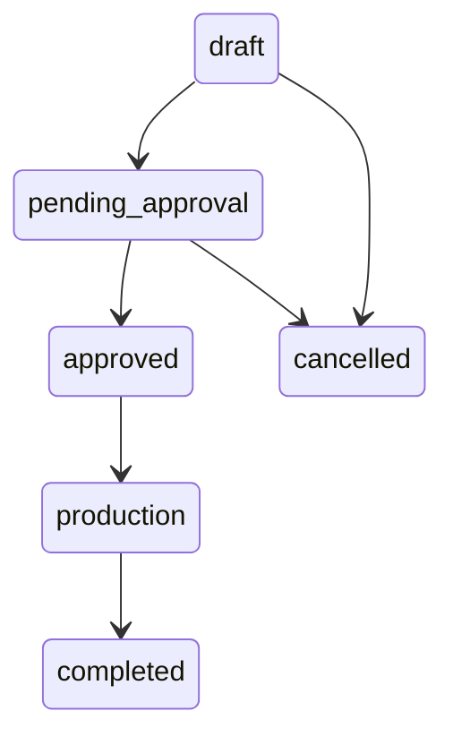

# OrgScript Mermaid Export

## Stateflow: OrderStatus

```mermaid
stateDiagram-v2
  state "draft" as s1_state_1
  state "pending_approval" as s1_state_2
  state "approved" as s1_state_3
  state "production" as s1_state_4
  state "completed" as s1_state_5
  state "cancelled" as s1_state_6
  s1_state_1 --> s1_state_2
  s1_state_2 --> s1_state_3
  s1_state_3 --> s1_state_4
  s1_state_4 --> s1_state_5
  s1_state_1 --> s1_state_6
  s1_state_2 --> s1_state_6
```

> Note: Mermaid export currently supports only process and stateflow blocks. Skipped: rule NoProductionWithoutApproval.
